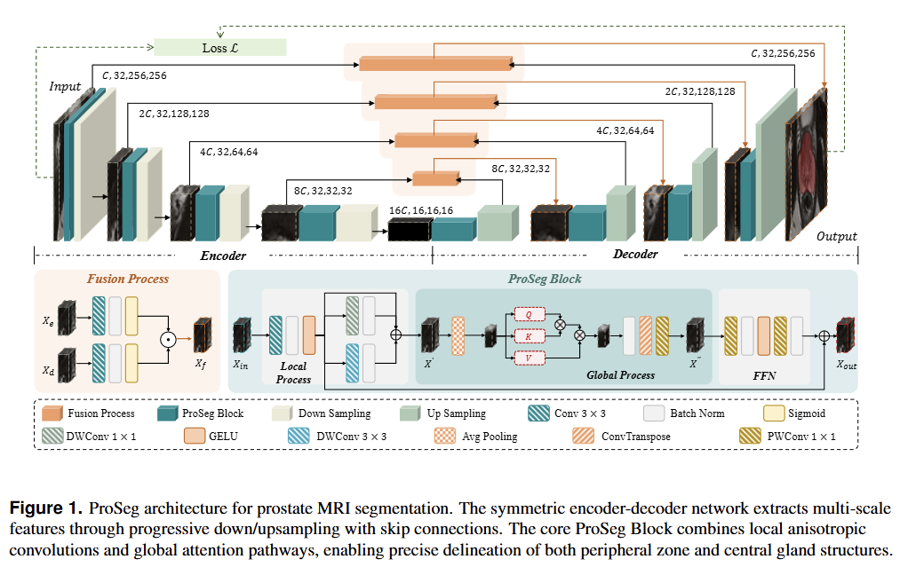
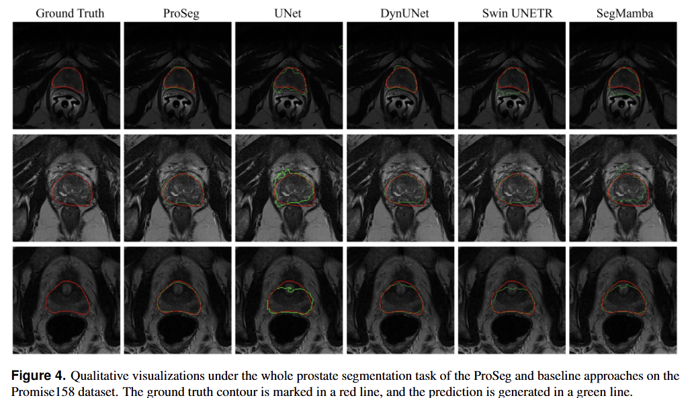

# ProSeg on nnU-Net v2

This repository is for hands-on training with a custom 3D segmentation model (`ProSeg`) inside the nnU-Net v2 training pipeline.

## 1) Environment Setup

Install PyTorch first, then install project dependencies:

```bash
pip install torch
sh setup-env.sh
```

## 2) Configure nnU-Net Paths

Set required environment variables:

```bash
export nnUNet_raw=/path/to/nnUNet_raw
export nnUNet_preprocessed=/path/to/nnUNet_preprocessed
export nnUNet_results=/path/to/nnUNet_results
```

Reference: [nnUNet path setup](nnUNet/documentation/setting_up_paths.md)

## 3) Prepare Dataset (Reuse Existing Public Datasets)

You can reuse common medical segmentation datasets (for example Promise12, Prostate158 or ProstateX), but data must be converted to nnU-Net v2 format.

Required format reference:
- [Dataset format](nnUNet/documentation/dataset_format.md)

Example folder:
- `nnUNet_raw/DatasetXXX_MyDataset/imagesTr`
- `nnUNet_raw/DatasetXXX_MyDataset/labelsTr`

## 4) Plan and Preprocess

Run fingerprint extraction and preprocessing for `3d_fullres`:

```bash
nnUNetv2_extract_fingerprint -d XXX
nnUNetv2_plan_and_preprocess -d XXX -c 3d_fullres
```

Replace `XXX` with your dataset ID, such as `005`.

## 5) Train with ProSegTrainer

Use this command (single-fold demo):

```bash
nnUNetv2_train XXX 3d_fullres 0 -tr ProSegTrainer
```

Optional 5-fold training:

```bash
nnUNetv2_train XXX 3d_fullres all -tr ProSegTrainer
```

Notes:
- The trainer internally fixes patch size to `(32, 128, 128)`.
- This corresponds to input tensor shape `C x 32 x 128 x 128` (3D volume).

## 6) Key Code Locations

- Trainer definition:
  `nnUNet/nnunetv2/training/nnUNetTrainer/variants/prostate/ProSegTrainer.py`
- Model definition:
  `nnUNet/nnunetv2/nets/ProSeg.py` (`ProSeg`)


## 7) Common Issues

- `Could not find requested nnunet trainer ...`
  - Check trainer name is exactly `ProSegTrainer`.
- `ModuleNotFoundError`
  - Ensure `sh setup-env.sh` has completed.
  - Confirm `nnUNet` was installed with `pip install -e .` inside the `nnUNet` folder.
- CUDA OOM
  - Use smaller batch size via nnU-Net plans/config or lower model dimensions in `nnUNet/nnunetv2/nets/ProSeg.py`.


# Datasets
The Promise12 dataset consists of multi-centric transversal T2 weighted MR volumes from 50 subjects. Image resolution ranges from 15 * 256 * 256 to 54 * 512 * 512 voxels with a spacing ranging from 2 * 0.27 * 0.27 to 4 * 0.75 * 0.75 mm. A single region is labeled in the ground truth. On the other hand, the Prostate dataset consists of 48 multi-parametric MRIs (32 MRIs are labeled) provided by Radboud University. Two structures are labeled in the ground truth: peripheral zone (PZ) and central gland (CG). We first merge these two regions into a single one to align with the Promise12 dataset. We then employ Prostate as the source domain and Promise12 as the target domain. Images from both datasets are re-sampled to an identical voxel-spacing of 2.0 * 0.5 * 0.5 mm.(The dataset is freely available at https://zenodo.org/records/8026660)

The Prostate 158 dataset consists of 158 expert annotated 3T prostate bpMRI images, including T2W and DWI images with ADC maps. The in-plane resolution of the T2W sequence is 0.47 * 0.47 mm. This dataset is designed to facilitate analysis of prostate anatomy, specifically the central gland and surrounding areas, and segmentation of suspicious lesions.(The dataset is freely available at https://github.com/kbressem/prostate158)

ProstateX dataset does not provide prostate zonal segmentation masks. Cuocolo et al. supplemented the dataset by incorporating lesion and zonal masks to facilitate prostate-related research, including lesion detection and zonal segmentation. The T2-weighted (T2W) images were acquired with an in-plane resolution of 0.5 * 0.5 mm. These cases were labeled with prostate zonal masks, encompassing approximately 4000 slices. Notably, these slices encompass situations where the prostate is not visible or lacks lesion annotations.(paper:Quality control and whole-gland, zonal and lesion annotations for the PROSTATEx challenge public dataset; https://wiki.cancerimagingarchive.net/display/Public/SPIE-AAPM-NCI+PROSTATEx+Challenges)

# Visulization 


# License

This project is licensed under the MIT License. See [LICENSE](LICENSE).


